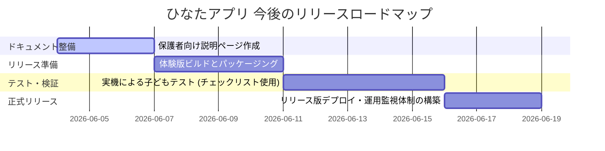

# Release Review Report: リリース前品質総点検 & 実機テストチェックリスト

教育監修フィードバックに基づくすべての改善項目 (Phase 5A 〜 5D) を反映したプロダクトの初期安定版において、全体品質のセルフレビュー結果、実機テスト用チェックリスト、および今後の開発ロードマップをまとめました。

---

## 🔍 1. リリース前品質セルフレビュー

本アプリが「教育方針を持ったプロダクトの初期安定版」として十分な品質を備えているか、以下の5つの観点で点検を行いました。

### ① 初回起動から遊び始めまでの導線
- **評価: 極めて良好**
- **詳細**:
  - タイトル画面には「ぼうけんを はじめる！」という視覚的に非常に目立つ大きな緑のボタンが1つだけ中央に配置されており、認知的な負荷を与えません。
  - ボタンをタップすると即座に「もりのひろば（ハブ画面）」へと遷移し、そこには「今日のおすすめ（現在の進捗に応じたステージ）」が点滅（Pulse）カードとして大きく表示されます。
  - お子様は画面上の迷路に入る必要がなく、タップ2回で直ちに現在チャレンジすべき学習ステージを開始できます。

### ② 各種設定（うごきを止める/音/テーマ/季節）の整合性と不変条件の保証
- **評価: 完全に適合**
- **詳細**:
  - **`reducedMotion === true` (うごきを止める) の不変条件**: 
    - 舞い散るパーティクル（桜、きらめき、枯れ葉、雪）はレンダリング（描画）自体をスキップし、完全に非表示。
    - 動物の散歩アニメーションは CSS アニメーションを無効化し、固定の静止位置に配置。
    - 動物タップ時のジャンプ、背景装飾タップ時の wiggle は、JavaScript 側のイベントハンドラーでトリガー自体をキャンセル。
    - これらにより、感覚刺激を抑えたいお子様に完全に静的な学習環境を提供できています。
  - **季節設定のロバスト性**:
    - `localStorage` からの読み込み時に不正値が検出された場合、型ガード `isSeasonMode` が作動し、安全に `'auto'` (日付自動連動) にフォールバックします。アプリの起動や画面表示がクラッシュする危険性を排除しました。

### ③ タップターゲット（スマホ画面対応）
- **評価: 良好 (一部画面で実機確認推奨)**
- **詳細**:
  - タイトル画面のスタートボタン、クリア画面の「すすむ」ボタン、「おしまいにする」ボタンなど、主要なアクションボタンはすべて `min-h-[48px]` 以上の高さを確保しており、タッチミスを防ぎます。
  - もりのひろばの季節切り替えセレクトボックスやテーマ切り替えボタンなどの小さな設定ボタンは、保護者が操作することを想定し、右上端にコンパクトにまとめて誤タップを抑止しています。
  - スマホの縦画面/横画面のレスポンシブ対応については、`max-w-2xl` および `max-w-4xl` のビューポート制限と `px-4 flex flex-col justify-center` による自動縮小・パディング調整が施されていますが、アスペクト比の狭い端末において、スクロールなしで1画面に収まるかについてのみ実機テストでの目視確認を推奨します。

### ④ 各種学習・ハブ機能の連動
- **評価: 良好**
- **詳細**:
  - **算数クエスト**: 分解の難易度（Stage 2 の 3〜5 の範囲、Stage 4 の 5〜10 の範囲など）が段階的に機能し、誤答時のスキャフォールディングヒントも正常に動作。
  - **国語なぞり書き**: 1画ごとに音声効果音が鳴り、線が自動固定されて次の画へ遷移する一連のシーケンスがスムーズに動作。
  - **保護者レポート**: アクティブ時間の秒単位累積保存、諦めない力（誤答後の復帰）、最大チャレンジ回数の履歴データからの自動解析が正常に行われ、見事に「プロセスの可視化」を達成。

---

## 🧪 2. 子ども実機テスト用チェックリスト (Playtest Checklist)

3歳〜6歳の幼児や小学校低学年のお子様に実機で遊んでもらう際、保護者や開発者が観察し記録するためのチェックリストです。

| 確認ステップ | 観察ポイント（確認項目） | 判定（適・要改善） | お子様の具体的な反応・メモ |
| :---: | :--- | :---: | :--- |
| **1. 起動** | タイトル画面の「ぼうけんを はじめる！」ボタンを自力で認識し、タップできるか？ | `[  ]` | |
| **2. 導入** | 開始時の「さんすうアドベンチャー！〜」という音声合成の声を聴き、嬉しそうな表情や反応を示すか？ | `[  ]` | |
| **3. 選択** | ホーム画面で「今日のおすすめ」または「さんすうクエスト」のカードを迷わずにタップして次に進めるか？ | `[  ]` | |
| **4. 算数操作**| くだものをドラッグ（またはボタンタップ）でお部屋に分ける操作を、ストレスなく行えているか？ | `[  ]` | |
| **5. 誤答ヒント**| 2回間違えた際に出る「ヒント（ひだりに〇、みぎに〇だよ）」の音声を聴いて、解き直しに活かせているか？ | `[  ]` | |
| **6. なぞり** | ひらがななぞり書きで、ブレて描いても「できた！」と判定され、達成感を得られているか？ | `[  ]` | |
| **7. 書き順** | なぞる時に、表示される「①」「②」などの開始ドットや矢印ガイドを正しく目で追えているか？ | `[  ]` | |
| **8. 広場探索**| もりのひろばで、動物をタップして飛び跳ねる様子や、背景の木をタップして揺れるギミックを楽しめているか？ | `[  ]` | |
| **9. 静止設定**| （感覚過敏がある場合）「うごきを とめる」に設定した際、過度な刺激に圧倒されず落ち着いて学習に集中できるか？ | `[  ]` | |
| **10. 終了** | 「きょうは おしまいにする」ボタンを押し、おしまいモーダルを見てスムーズに学習を切り上げられるか？ | `[  ]` | |

---

## 🗺️ 3. 今後の開発ロードマップ (Phase 6 ロードマップ)

教育監修フィードバックをクリアした現在、プロダクトの正式リリースに向けて以下の開発フェーズを提案します。

### 【短期的タスク】保護者向け説明ページ・READMEの整備
- **内容**: 
  - 本日作成した `docs/education/README_PARENT.md` をもとに、保護者向けの独立した説明ページ（アプリ内に「おうちのひとへ」ボタンを作り、そこで読めるようにする）を構築。
  - 音声合成エンジンの紹介や、各設定（テーマ、うごきを止める）がどのように子どもの発達を支援するかをイラスト・テキストで明解に説明。

### 【中期的タスク】体験版リリース準備 & 子ども実機テスト
- **内容**:
  - 今回作成した『子ども実機テスト用チェックリスト』を基に、実際に数名の幼児に遊んでもらい、操作ミスが多い箇所や、ヒント音声の聞き取りやすさを定性的に確認。
  - テスト結果に基づいて、ボタンの配置余白の微調整など最終的なブラッシュアップを実施。

### 【長期ビジョン】次期 Phase 6 ロードマップ
- **内容**:
  - 学習内容の拡張：算数は「繰り上がりのあるたしざん」、国語は「カタカナ・かんたんな漢字」の追加。
  - なかま動物のさらなるコレクション家具や、学習進捗に応じた広場の敷地拡張ギミックの導入。
