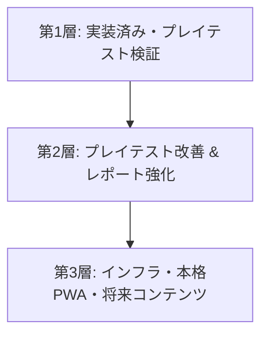

# システム要件定義書：ひなたアプリ

本ドキュメントは、5歳児から小学校1年生までの2年間を支援する教育プラットフォーム『ひなたアプリ』のシステム要件定義書です。文部科学省の「幼保小の架け橋プログラム」、UDL（ユニバーサルデザイン・フォー・ラーニング）ガイドライン、および自己決定理論を基盤として設計されています。

本作は、すべてを一度に実装するのではなく、**「実装済みの状態を子どもにそっと手渡し、自然に出る反応を受け取る」**というプレイテスト主導の開発サイクルを採用します。

---

## 1. プロジェクト概要

### 1.1. プロダクト構造と名称定義
『ひなたアプリ』は、以下の領域およびモジュールによって構成される教科横断型プラットフォームです。

- **正式プロダクト総称**: ひなたアプリ
- **ホーム／横断ハブ**: もりのひろば
- **算数領域名**: さんすうクエスト 〜くだものキングダム〜
- **国語領域名**: あいうおんどくのもり（ひらがな盤、もじなぞり）
- **心身観察領域**: 世界研究所（World Research Lab / WRL）／世界研究ノート
- **公開URL**: [https://hinata-app-76745.web.app/](https://hinata-app-76745.web.app/)

### 1.2. 目的と理念
幼児期（年長）の遊びから小学校1年生の教科学習へのスムーズな接続（架け橋）を目的とし、**「数字を教える前に、量が見える世界をつくる」**をコアコンセプトに掲げます。
単なる計算ドリルではなく、具体操作を通した数と量の身体的・直感的一致を図り、子どもの内発的動機（主体性）と非認知能力を育みます。

### 1.3. ターゲットユーザー
- **メインユーザー**: 5歳〜7歳（年長〜小学校1年生）の児童
- **サポートユーザー**: 保護者・指導者（学習履歴の確認、環境設定を行う）

---

## 2. 教育設計要件（ひなた架け橋プログラム）

ひなたアプリは心理学的アプローチである「自己決定理論」の3つの基本的心理欲求に基づき設計されます。

1. **自己決定 (Autonomy)**
   - 子ども自身が「今日やる学習内容」を複数の選択肢から選べるようにし、学習への主体的関わりを促す。
2. **スモールステップと足場かけ (Competence & Scaffolding)**
   - 失敗をペナルティとして扱わず、子どもの習熟度や誤答状況に応じたステップアップと、音声・ビジュアルによる具体的なヒント（足場かけ）を提供する。
3. **プロセス承認 (Relatedness & Recognition)**
   - 正答率や回答の速さではなく、挑戦した回数やあきらめない姿勢（プロセス）を可視化し、保護者との温かいコミュニケーションを促進する。

---

## 3. 要件の3層構造（開発・検証フェーズ分類）

要件を「現在実装済み・プレイテスト対象」「近未来の実装・改善候補」「将来要件（P2以降）」の3層に分類し、段階的に開発・検証を進めます。

### 3.1. 第1層：現在実装済み・プレイテスト対象
現バージョンの実機プレイテストを通じて、子どもたちからの自然な反応を受け取ることを目的とする検証対象機能です。

#### 【ホーム/ハブ】
- **今日の3択**: 起動時に3つの選択肢（さんぽする、さんすうを1問やる、ひらがなであそぶ）を提示し、子ども自身が自律的に選択する仕組み。
- **さんすう1問導線**: 心理的負荷を下げ、1つの課題だけで満足して終わることを許容する導線。

#### 【算数領域：さんすうクエスト】
- **10マスおやつ箱**: 上段5・下段5のテンフレームを使い、7〜10の数を「5とあといくつ」で視覚的に捉える。
- **どうぶつおやつわけ**: 特定 of 正解に拘泥せず、合計が合っていれば全ての分配比率を正解とする探索的な数の分解。
- **10のともだちたいこ**: 太鼓のタップ打鍵数と優しいコード音により、10の補数を身体的に体感する。叩きすぎても優しく自動リセット。
- **さくらんぼたいじ (10をつくってから足す)**: 繰り上がり（サクランボ計算）のビジュアル移動と数式・音声ガイドの連動。

#### 【国語領域：あいうおんどくのもり】
- **ひらがな盤 MVP**: 基本的なひらがなとの出会いを提供する音声付き盤面。

#### 【心身観察領域：世界研究所（WRL）】
- **世界研究ノート / SOS・観察導線**: 子どもの心身の状態や気分の揺らぎを、否定的な評価を伴わずに記録・観察する導線。WRLでは、子ども画面には短く安心できる表現のみを表示し、詳細な分析・仮説・支援メモは保護者向け領域に分離する。

---

### 3.2. 第2層：近未来の実装・改善候補
プレイテストから得られたフィードバックを基に、優先的に実装・強化を行う機能です。

#### A. プレイテスト観察の整備（QA連携）
プレイテスト時に以下の観点を評価し、UI/UXの微調整を行います。
- 子どもが説明なしで「今日の3択」の意味を理解し、自律的に選べるか。
- 1問解いた後に無理なく学習を終え、達成感を得られているか。
- 10マス・おやつ箱・太鼓の操作感が直感的で、説明なしで伝わるか。
- ひらがな盤の音声ガイドが、子どもにとって心地よいテンポ・声質であるか。
- 世界研究所（WRL）のSOS表現やアラート表現が、子どもの心理的負担（重さ）になっていないか。

#### B. 保護者レポートの強化（プロセス承認ログ）
「何問中何問正解したか」の評価ではなく、子どもの主体性や試行錯誤のプロセスを伝えるためのログ機能を追加します。
- **記録するプロセス項目**:
  - 自分で今日の活動を選べたこと（自己決定）
  - ヒントを活用して自力で解決できたこと（足場かけの有効性）
  - 途中で一度離脱しても、また戻って再挑戦できたこと（回復弾力性）
  - 今日はあえて「静かな設定（Reduced Motionなど）」を選んだこと（自己調整）
  - 記号計算を急がず、量を見て考えていたこと（熟慮）
- **リフレーミング表示**: 保護者が我が子を評価するのではなく、「今日の様子を理解し、寄り添うための支援の手がかり」となる表現に翻訳してダッシュボードに表示。

#### C. UDL/アクセシビリティの順次強化
- **Reduced Motion (視覚負荷低減) の拡張**: パーティクルの完全非表示設定など。
- **連打対策の徹底**: 子どもの予測不能な連打操作による、多重アクションや内部ステートの崩壊を防ぐインターロックの強化。

---

### 3.3. 第3層：将来要件（P2/P3/P4以降）
MVP（最小限の検証可能製品）の価値が確認された後に、プラットフォームとしての安定性やコンテンツ拡張のために実装する要件です。

#### 【インフラ・データ管理】
- **メールリンク認証**: 匿名ログインから正式アカウントへの昇格とセーブデータ保持。
- **Firestoreによる自動クラウド同期**: 複数端末間での進捗同期。
- **オンライン復帰時の自動同期ロジック**: 通信不安定な環境でのデータ競合処理。

#### 【ホーム/ハブ機能の拡張】
- **家具配置システム**: どんぐり等で集めた家具を配置するカスタマイズ機能。
- **どうぶつアニメーション**: 広場内を歩き回る動物の表示上限拡張（最大3体）とモーションバリエーション。

#### 【国語領域の本格化】
- **もじなぞり書きCanvasの通過判定**: 厳格すぎない通過チェックポイント式書き順判定ロジック。
- **文字からイラストへの変身演出**: なぞり書きクリア時に文字が動物のイラストへ変身するアニメーション。

#### 【非機能・OS連携】
- **Android物理バックボタンの完全制御**: ブラウザ離脱やリセットを防ぐ履歴割り込み処理。
- **iOS/Android PWAの完全検証**: 機内モード下での3秒以内起動やアセットキャッシュ戦略の高度化。

---

## 4. 非機能要件（共通基本ライン）

- **タッチターゲット**: すべての操作ボタンを **44px × 44px以上**（PWAは **48px以上**）とする。
- **コントラスト比**: パステルカラー背景上の文字のコントラスト比を **4.5:1以上**（濃色文字の強制）とする。
- **操作の冗長性**: ドラッグ＆ドロップ操作だけでなく、シンプルなタップ操作のみでも同等に機能する代替UIを担保する。
- **音響一括ミュート**: ミュート時はBGM、効果音、音声合成のすべてが一括で無音化されること。
- **ピンチズーム禁止**: 子供の誤操作によるピンチイン・アウト（画面拡大・縮小）を完全に禁止する。

---

## 5. 技術仕様

- **フロントエンド**: React 19, TypeScript, Vite
- **スタイリング**: Tailwind CSS v4 (CSS-first configuration)
- **データベース/認証**: Firebase Authentication、Cloud Firestore
  - 現時点ではローカル保存中心
  - 匿名認証、メールリンク同期、Firestoreによる複数端末同期は第3層で本格化
- **オーディオ**: Web Audio API (コード合成エンジン), Web Speech Synthesis API (音声ガイド)

---

## 6. 現行実装との対応表（トレーサビリティマトリクス）

現在デプロイされているアプリの実装状態と、要件定義における位置づけ、および今後のアクションを一覧化します。

| 要件項目 | 現在の実装状況 | 開発層分類 | プレイテスト時の観察ポイント / 次のアクション |
| :--- | :--- | :--- | :--- |
| **今日の3択** | 実装済み | 第1層 (テスト対象) | 子どもが説明なしで自分で選択肢を選べるか観察する。 |
| **さんすう1問導線** | 実装済み | 第1層 (テスト対象) | 1問で満足して終われるか、精神的負担がないか確認。 |
| **ひらがな盤 MVP** | 実装済み | 第1層 (テスト対象) | 音声ガイドの速度やトーンが心地よいか確認。 |
| **10マスおやつ箱** | 実装済み | 第1層 (テスト対象) | 「5のまとまり」が視覚的に伝わっているか確認。 |
| **どうぶつおやつわけ** | 実装済み | 第1層 (テスト対象) | 自由な組み合わせすべてが肯定される楽しさを感じるか。 |
| **10のともだちたいこ** | 実装済み | 第1層 (テスト対象) | 叩きすぎた際のリセット挙動およびリズムへの反応を見る。 |
| **さくらんぼたいじ** | 実装済み | 第1層 (テスト対象) | 繰り上がり時のおやつの移動アニメーションの理解度。 |
| **世界研究所 (WRL)** | 実装済み | 第1層 (テスト対象) | SOS表現や観察ノートの記録が親子の負担にならないか。 |
| **Reduced Motion** | 一部実装 | 第1層 / 第2層 | プレイ中の過度なパーティクルが刺激になっていないか。 |
| **連打対策** | 一部実装 | 第1層 / 第2層 | ボタン連打による多重解答やフリーズが起きないか。 |
| **保護者レポート** | 一部実装 | 第2層 (強化候補) | **【次アクション】** プロセス承認ログ（自己決定、ヒント使用等）を追加する。 |
| **Firestore同期** | 未実装 | 第3層 (将来要件) | プレイテストで継続価値が見えたのち、PWA安定化の後に検討。 |
| **なぞり書きCanvas** | 未実装 | 第3層 (将来要件) | 第1層のひらがな盤のテスト結果を受け、P4以降で詳細設計。 |
| **家具配置/動物アニメ**| 未実装 | 第3層 (将来要件) | ハブとしての「もりのひろば」拡張フェーズ（P2以降）で検討。 |
| **iOS/Android PWA検証**| 未検証 | 第3層 (将来要件) | オフラインキャッシュやホーム画面追加の挙動を実機で順次テスト。 |
